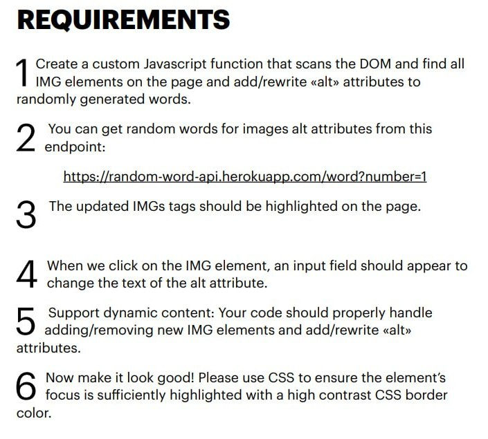

Задание на подключение к существующим и слежение за новыми картинками  на странице.

## Задание для https://t.me/c/1936569871/328/574

**Проверял на гугл-картинках**

### Основная функция IIFE

- func.js

### Файлы для внутреннего тестирования

- index.html
- style.css
- js.js

### Слежение через MutationObserver

